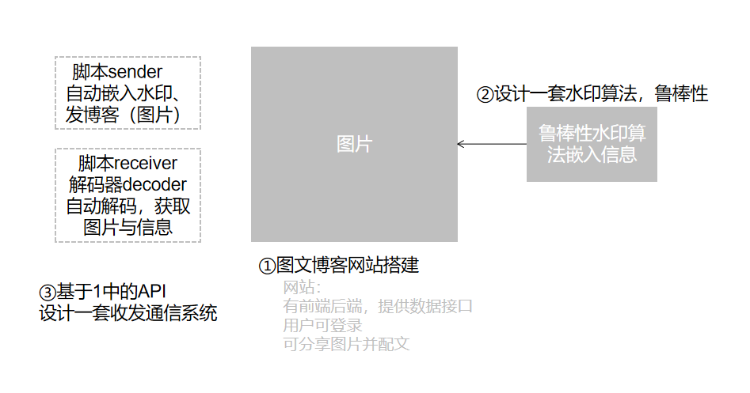
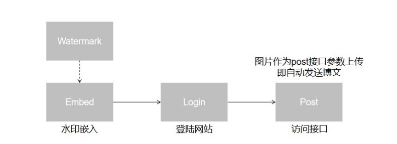
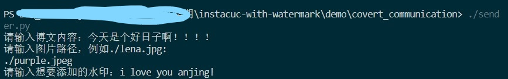
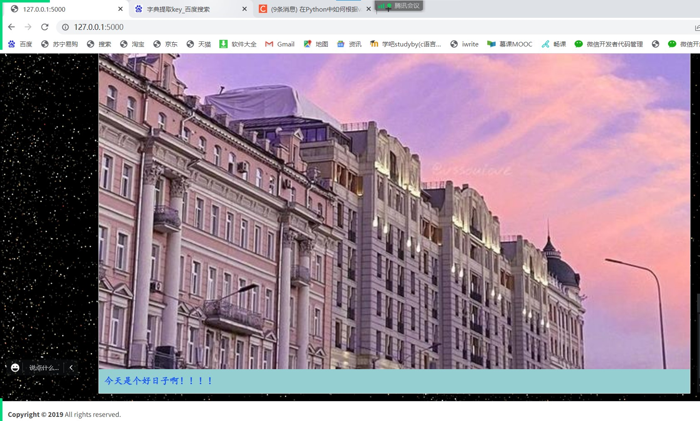
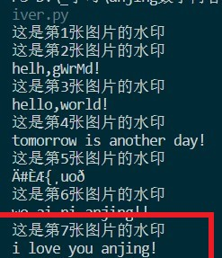
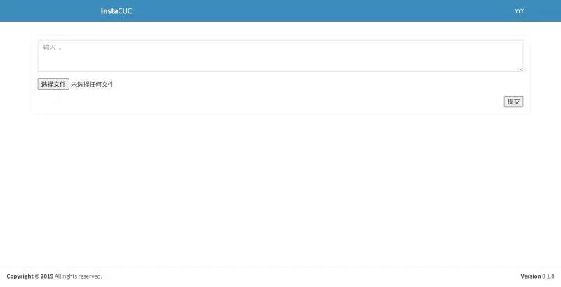
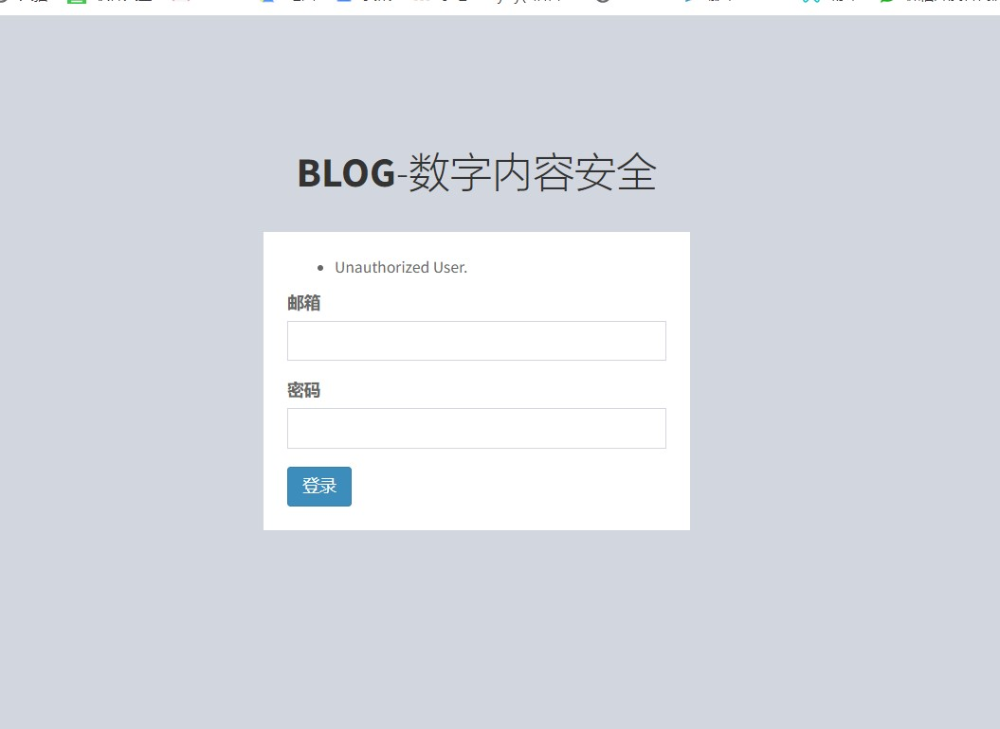
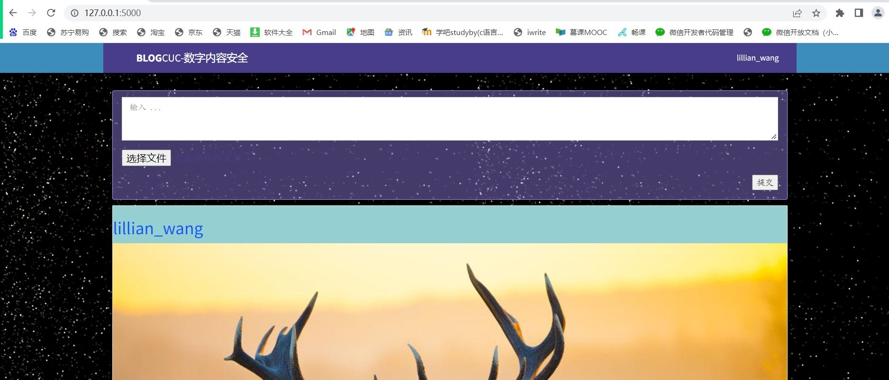

# 基于数字水印的隐蔽通信系统实验报告

## 一、实验任务

#### 1、图文博客网站，提供`HTTP API`。

其中网站的用户可登录，发布文字及图片。网站需要存在前端，后端，`API`接口。

**Learn Flask The Hard Way:**

##### (1)**0x00** `Flask`简介

##### (2)**0x01** `Jinja`模板

##### (3)**0x02** `WTForms`表单

##### (4)**0x03-0x05** 实现文件上传

##### (5)**0x06-0x07** 实现用户登录(**0x06**未引用数据库，在**0x07**中引入数据库)

##### (6)`flask_admine/templates/base.html`：引入网页布局框架和样式


#### 2、设计水印算法，图片需要使用鲁棒性水印算法嵌入信息。

##### （1）实现水印算法：

###### 			a.将空域图片切割为8*8块

###### 			b.进行DCT变换，转为频域图像。

###### 			c.在每块中嵌入信息。

###### 			d.交换其中的（2,1）和（1,2）的系数。

​			【注意】：

​			**如果嵌入的是1的话**，保证其中(2,1)>(1,2),否则需要交换一下

​			以alpha为水印强度,如果(2,1)-(1,2)<alpha,则需要(2,1)+=alpha,提高水印强度

​			**如果嵌入的是0的话**，保证其中(2,1)<(1,2),否则需要交换一下

​			以alpha为水印强度,如果(1,2)-(2,1)<alpha,则需要(2,1)-=alpha,降低水印强度

##### （2）使用扩频技术：

​			增加了鲁棒性,减少了容量


#### 3、基于1的`API`设计一套收发通信系统。

##### （1）**SENDER**:

找一张图片,嵌入水印,再将其上传

send_post：先获取csrf_token,发出post请求实现登录,以上传接口上传

##### （2）**RECEIVER**:

循环获取post上传的图片,将其提取水印

## 二、系统逻辑



1. 命令行运行`flask run`命令，寻找当前目录下寻找`app`包，在`_init_.py`，选择`app`变量，再将其（实际上是`create_app`）执行起来。

2. `create_app`内容：

   **前半部分：**

   导入模块、子包、包、类、函数、变量以及在包的`_init_.py`中已经导入的名字

   **后半部分：**

   ```python
   # 创建flask_app对象
   def create_app():
       flask_app = Flask(__name__, instance_relative_config=True)
       # 套用flask_adminlte模板追加路由使之成功访问
       AdminLTE(flask_app)
   
       # 对flask的配置，使其获取环境变量FLASK_CONFIG
       config_name = os.getenv('FLASK_CONFIG', 'default')
       # 通过已引入`config`对象读取应用配置
       flask_app.config.from_object(config[config_name])
       flask_app.config.from_pyfile('app.cfg', silent=True)
   
       # 配置上传文件的路径
       upload_path = Path(flask_app.instance_path) / 'upload'
       if not Path(flask_app.instance_path).exists():
           Path(flask_app.instance_path).mkdir()
       if not upload_path.exists():
           upload_path.mkdir()
   
       # config中添加字段UPLOAD_FOLDER，相当于全局变量，上传目录保持一致
       flask_app.config['UPLOAD_FOLDER'] = str(upload_path)
   
       # 登录管理，对flask_login进行配置
       login_manager.session_protection = 'AdminPassword4Me'
       login_manager.login_view = 'auth.login'
       login_manager.login_message = 'Unauthorized User.'
       login_manager.login_message_category = "info"
   
       # 绑定于flask_app
       login_manager.init_app(flask_app)
       db.init_app(flask_app)
       bcrypt.init_app(flask_app)
       # 绑定功能：导入的数据库，加密和迁移（现代数据库开发共有的概念）
       migrate.init_app(flask_app, db)
   
       for bp in all_blueprints:
           import_module(bp.import_name)
           flask_app.register_blueprint(bp)
       flask_app.register_blueprint(api_bp)
   
       # 将blueprints注册到app上
       user_cli = AppGroup('user')
   
       # click插件集成
       @user_cli.command('create-admin')
       @click.argument('email')
       @click.argument('name')
       @click.argument('password')
       def create_admin(email, name, password):
           user = User(email=email,
                       email_confirmed=True,
                       name=name,
                       role=UserRole.ADMIN)
           user.password = password
   
           db.session.add(user)
           db.session.commit()
   
       flask_app.cli.add_command(user_cli)
   
       return flask_app
   
   
   if __name__ == "__main__":
       flask_app = create_app()
       flask_app.run(host='0.0.0.0', port=5000, debug=True)
   ```

   其中`blueprints`包括`home`和`auth`，分别对应`app.public.views`和`app.auth.views`

   **ps.**`app.public.view`中如果是“/”返回`home.h`，如果是`images/<image_name>`就发送图片

3. `api_bp`:实现前后端分离

   将后端资源封装成符合此API的格式；创建API（符合本框架自身的功能）供前端访问

   

   引入-->`app.resorces.views`

   -  导入

   - 设置`blueprint`,将`api`和数据中的`api`相对应使用第三方库`flask_restful`，通过它可以实现

     a.将`api`绑定到蓝图`api_bp`

     b.返回对象添加博客的博文资源（`PostResource`）

     c.获得当前的博文列表(`PostList`)

4. `PostSchema`:如何制表，如何存表

5. `PostResource`:单条博文（获取，编辑和删除）

6. `PostList`:自动生成分页，将新的博文添加并存储到列表

   `get`:`RECEIVER`，访问`GET/api/posts`

   `post`:`SENDER`，访问`POST/api/posts`

7. `SENDER`：

   在图片中嵌入水印，再登录网站，访问`POST/api/posts`并发送

   

   先登录，绕过`csrf_token`安全机制，先将其登录页面获取，再一起`POST`，即可登录成功。最后上传图文。
   
   `RECEIVER`：
   
   先登录，获取所有博文，循环下载图片，一个个提取。获取博文接口不需要登录权限。


## 三、实验过程

1.`pipenv`创建虚拟环境并启动

```bash
pipenv install flask 
pipenv install flask-wtf 
pipenv install flask-login 
pipenv install flask-sqlalchemy 
pipenv install flask-migrate 
pipenv install flask-restful 
pipenv install flask-marshmallow 
pipenv install flask-bcrypt 
pipenv install marshmallow-sqlalchemy 
pipenv install email-validator

pipenv shell
```

2.`flask`启动网站

```bash
#切换到0x09文件夹下，不然容易找不到app而报错
cd .\0x09_InstaCUC

# 初始化数据库
flask db init

# 生成迁移文件
flask db migrate

# 迁移数据库，即创建database以及各个表
flask db upgrade

# 创建管理员账号
flask user create-admin <username@email.com> <username> <password>

# 运行站点
flask run
```

3.启动水印程序`sender.py`和`receiver.py`，观察是否在http://127.0.0.1:5000上已经生成。

(1)自定义生成水印



(2)去http://127.0.0.1:5000查看新博客



(3)批量提取水印并展示



## 四、实验改进

##### 1.更改了水印相关操作

`sender.py`：添加了一些交互，用户可以自行输入想要发送和添加水印的图片、博文内容。

```bash
if __name__ == '__main__':

	#输入之前flask注册的管理员邮箱和密码
    username = '<user@email>'
    password = 'xxxxxx'

	#输入想要发送的博文内容
    text = str(input('请输入博文内容：'))

	#让用户自己写想要发送的图片路径，并且有试错机制，如果输入不正确的路径会出现报错
    for i in range(40):
        image_file = input('请输入图片路径，例如./lena.jpg:\n')
        if os.path.exists(image_file) == False :
            print("您输入的路径错误！请重新输入！")
        else:
            break

    #image_file = r'./purple.jpeg'
    url = 'http://127.0.0.1:5000'

    new_image = Path(image_file).with_name('embed.jpg')

	#输入想要在图片上添加的水印
    water_input=str(input("请输入想要添加的水印："))

    embed_watermark(image_file, water_input, str(new_image))
    #embed_watermark(image_file, 'hello,world!', str(new_image))

    send_post(username, password, text, str(new_image), url)

```

`receiver.py`：每次提取水印时添加了一个打印是第几张图片的水印的功能，这样可以更加方便的看出对应的水印和图片。

```
def get_post(url):
    s = requests.session()

    r = s.get(url + '/api/posts')

    posts = r.json()['results']

    for post in posts:
        print("这是第"+str(post['id'])+"张图片的水印")
        image_file = download_file(url + '/images/' + post['image'])
        extract_watermark(image_file)
        
```


##### 2.对网站进行界面优化（详情见代码）

原网站：




改进后的网站：






